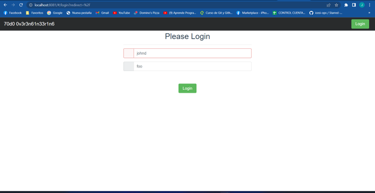
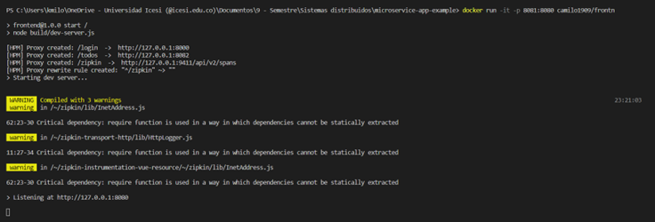
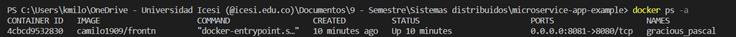

# sd-workshop3
Repor for workshop3
- Create dockerfile for the next code ->https://github.com/icesi-ops/microservice-app-example/tree/master/frontend and push it to dockerhub
- Create a README.md showing the execution of container (a screenshot say more than 1000 words)
- Make a pull request to this repo.

Due date 10/05/20222 at 8:30PM

### 
<h1 align="center">Developed by Juan Camilo Vargas 💻 </h1>

La imagen se encuentra en DockerHub en [Enlace Repositorio](https://hub.docker.com/r/camilo1909/frontn)

# Frontend Deploy

# Docker Run

# Docker PS

